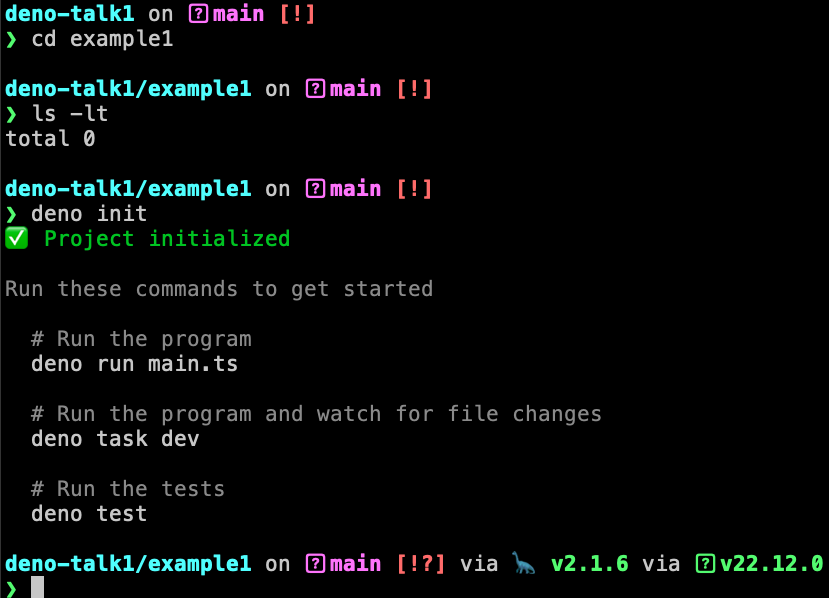
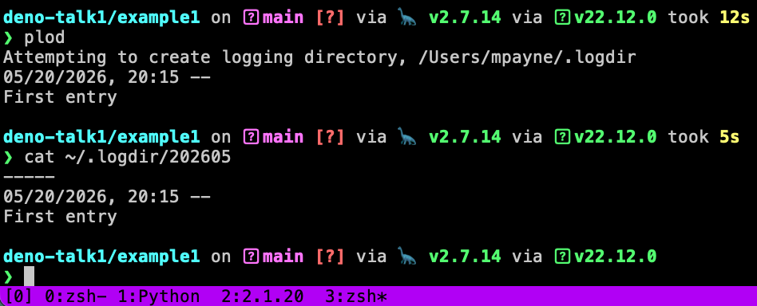
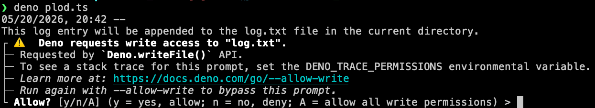
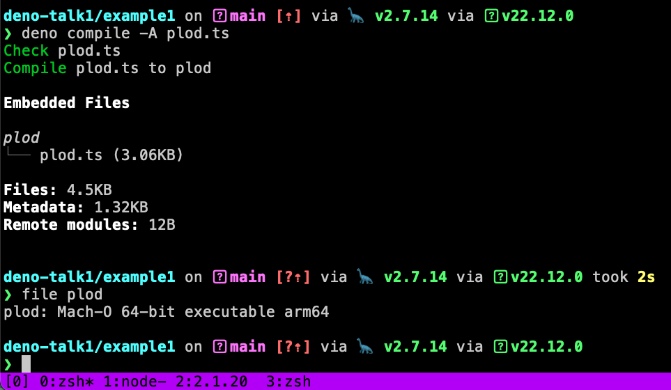
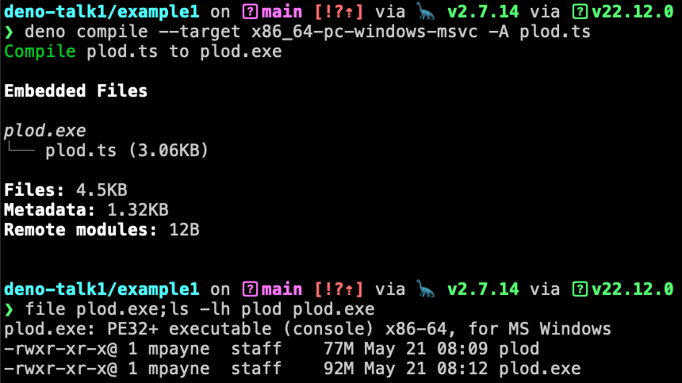
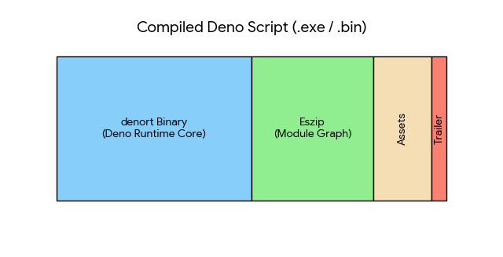

# Deno is node reimagined and node compatible

- Handy runtime for JavaScript and TypeScript
- Builds stand alone executables for Windows, Linux, and Macintosh OS X

### During this 30-minute discussion
- We'll build a command line utility

---

# I like deno because

- `deno compile` bundles the application to run on computers without deno installed.
- [deno has a nice security model by default code is not allowed to do more than run (no file system or network access).](https://docs.deno.com/runtime/fundamentals/security/) `-A` for the lazy is handy.
- Diverse, competitive ecosystems can make things better

---

# Let's write some typescript!

This talk is not a television episode.  There is a pre-recorded YouTube of this talk if that's your jam.

Let's interact!  Let's have fun!

## Goal -- in 30 minutes or less 
- We'll build a command line utility -- a simple version of plod
  - [plod is a 33+ year old utility for keeping a work journal](https://www.usenix.org/legacy/publications/library/proceedings/lisa93/full_papers/pomeranz.pdf) the link takes you to a [USENIX.org](https://www.usenix.org/) paper from 1993.
- Show off a tiny hello world web application
  - I want to show you a trick that warms my heart

---

# `deno init` in an empty folder



remember: `deno fmt` and `deno lint`


---

# `plod` -- happy path one
1. `brew install plod` on my Macintosh
2. `plod` looks like this:



---

# Dated log entry

```
const now = new Date();
console.log(`${now} --`);
const entry = prompt(``);
console.log(`Log entry is:\n"${entry}"`);
```

# Dates frequently involve boiler plate:
```
const now = new Date().toLocaleString("en-US", {
  month: "2-digit",
  day: "2-digit",
  year: "numeric",
  hour: "2-digit",
  minute: "2-digit",
  hourCycle: "h23",
});
console.log(`${now} --`);
const entry = prompt(``);
console.log(`Log entry is:\n"${entry}"`);
```

---

# `deno plod.ts`

```
❯ deno plod.ts
05/20/2026, 20:31 --
Hello world!  TIL deno has a built in `prompt("What is your name?")` function.
Log entry is:
"Hello world!  TIL deno has a built in `prompt("What is your name?")` function."
```

---

# await for the output to finish

```
await Deno.writeTextFile("log.txt", `${now} --\n${entry}\n`, { append: true });
```
## Warm & fuzzy security feelings


## human nature says: `deno -A plod.ts`

---

# allow multiline logs

```
async function multiLinePrompt(promptString: string) {
  if (promptString) console.log(promptString);

  const decoder = new TextDecoder();
  let input = "";

  for await (const chunk of Deno.stdin.readable) {
    input += decoder.decode(chunk);
  }
  return input;
}
```


---

# Put a [shebang](https://en.wikipedia.org/wiki/Shebang_(Unix)) on it!

```
#!/usr/bin/env -S deno run -A
const currentNow = now();
const entry = await entryFrom(Deno.args) ?? await entryFrom(currentNow);
await Deno.writeTextFile(logFilePath(), `${currentNow} --\n${entry}\n`, {
  append: true,
});
```

note the `await` percolates up when we use `async` 

---

# I :heart: `deno compile`




---

# Cross compiling is also cool



---

# Well... Actually it's bundling not compiling

 

---

# BTW - avoid putting binaries into a git repository

```
❯ git push
Enumerating objects: 21, done.
Counting objects: 100% (21/21), done.
Delta compression using up to 8 threads
Compressing objects: 100% (16/16), done.
Writing objects: 100% (16/16), 66.77 MiB | 7.41 MiB/s, done.
Total 16 (delta 7), reused 0 (delta 0), pack-reused 0 (from 0)
remote: Resolving deltas: 100% (7/7), completed with 4 local objects.
remote: warning: See https://gh.io/lfs for more information.
remote: warning: File example1/plod is 77.36 MB; this is larger than GitHub's recommended maximum file size of 50.00 MB
remote: warning: File example1/plod.exe is 91.72 MB; this is larger than GitHub's recommended maximum file size of 50.00 MB
remote: warning: GH001: Large files detected. You may want to try Git Large File Storage - https://git-lfs.github.com.
To github.com:payne/deno-talk1.git
   840dea7..f181d5d  main -> main
```

is github for what the heck!

---

# Launch the local browser
```
async function openBrowser(url: string) {
  const commands: Record<string, string[]> = {
    darwin: ["open", url],
    windows: ["cmd", "/c", "start", url],
    linux: ["xdg-open", url],
  };

  const cmd = commands[Deno.build.os];
  if (cmd) {
    const command = new Deno.Command(cmd[0], {
      args: cmd.slice(1),
      stdout: "null",
      stderr: "null",
    });
    await command.spawn();
  }
}
```

---

# Tiny Web Server

```
function main() {
  // Open browser after a half second delay
  setTimeout(() => openBrowser(`http://localhost:${PORT}`), 500);

  Deno.serve({ port: PORT }, async (req) => {
    const dateStr = new Date();
    return new Response(`Time is now: ${dateStr}`);
  });
}
main();

```

---

# [Red Burns lives on](https://rhizome.org/editorial/2013/aug/26/red-burns-lives-on/)


## [“Technology is Not Enough”](https://rhizome.org/editorial/2013/aug/26/red-burns-lives-on/)

### "consider the technology as a tool which, in itself, could do nothing,"

### "treat the technology as something that everyone on the team could learn, understand, and explore freely."


